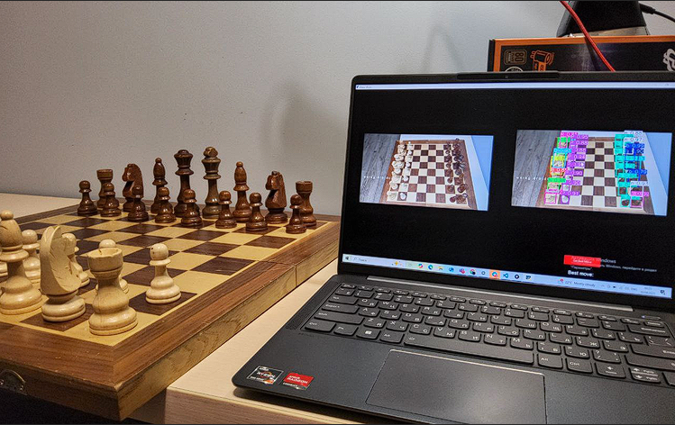

# Computer-Vision-Chess-Analysis
Computer vision system for real-time analysis of a physical chessboard. Uses YOLO-based piece detection, board state reconstruction, FEN generation, and the Stockfish engine to suggest the best move via a Python GUI.

  

A computer vision system that analyzes a **physical chessboard in real time**, reconstructs the board position, and suggests the best move using the Stockfish chess engine.

The project combines object detection, chess logic, and a graphical user interface to bridge physical and digital chess.

---

## Features
- Real-time chessboard capture using a camera
- Chess piece detection with YOLOv8
- Automatic board state reconstruction
- FEN generation from detected pieces
- Best move calculation using Stockfish
- GUI with live camera feed and move visualization

---

## System Overview
**Pipeline:**
1. Capture live video of a physical chessboard
2. Detect and classify pieces using YOLOv8
3. Map detections to board squares
4. Build FEN representation
5. Analyze position with Stockfish
6. Display best move in the GUI

---

## Tech Stack
- Python 3.10
- OpenCV
- YOLOv8 (Ultralytics)
- Stockfish
- python-chess
- Tkinter
- NumPy
- Pillow

---

## Hardware Setup
- Physical 8×8 chessboard
- Camera (1080p, USB / DroidCam)
- Windows PC (x64)

---

## Results
- Up to **97–100% detection accuracy** under good lighting
- Real-time move suggestions
- Robust performance in mid-game positions
- Performance decreases under poor lighting or rotated boards

---

┌─────────────┐
│   Camera    │ ──> Captures live chessboard
└──────┬──────┘
       │
       v
┌─────────────┐
│   YOLOv8    │ ──> Detects pieces & positions
└──────┬──────┘
       │
       v
┌─────────────┐
│ Board Logic │ ──> Builds 8x8 matrix
└──────┬──────┘
       │
       v
┌─────────────┐
│ FEN Builder │ ──> Converts to chess notation
└──────┬──────┘
       │
       v
┌─────────────┐
│  Stockfish  │ ──> Analyzes & suggests moves
└──────┬──────┘
       │
       v
┌─────────────┐
│  Tkinter    │ ──> Displays results
└─────────────┘
