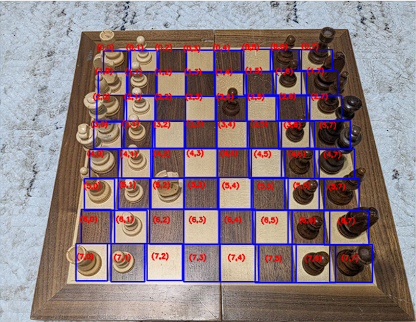
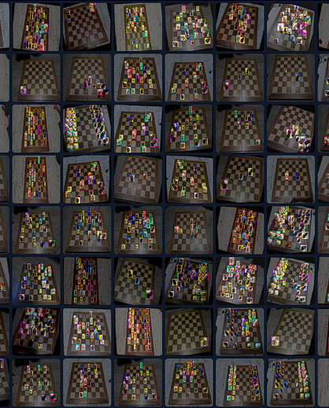
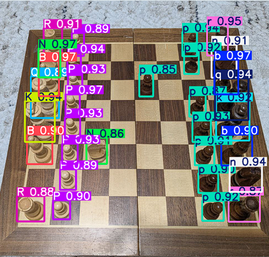
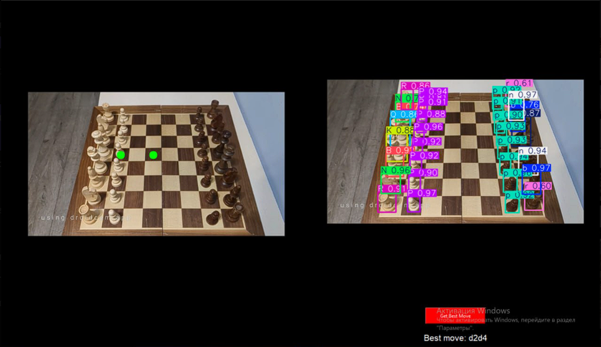

# Project Overview

## Purpose
This project implements a **computer vision–based chess analysis system** that recognizes the state of a physical chessboard from a live camera feed and suggests the best move using the Stockfish chess engine.  
The goal is to bridge physical and digital chess by enabling real-time analysis without manual board input.

---

## High-Level Pipeline
1. Capture live video from a camera mounted above the chessboard
2. Calibrate chessboard corners using mouse-based user input
3. Generate square bounding boxes for all board cells
4. Detect chess pieces using a YOLOv8 model
5. Map detections to board squares based on calibration
6. Convert board state to FEN notation
7. Analyze the position using Stockfish
8. Visualize results in a graphical user interface

This pipeline is designed for stable and repeatable analysis.

---

## Code
All core logic is implemented in Python and organized as a single executable pipeline.

**Main implementation:**  
[Main Script](../Code/main_code/)

---

## System Architecture

### Calibration Layer
- User manually selects **9×9 chessboard corner points** by clicking on the image
- Calibration is performed once and reused in subsequent runs
- From the selected points, **64 square bounding boxes (8×8)** are generated
- Bounding boxes are used as a geometric reference for piece-to-cell mapping

  

---

### Model Training
- YOLOv8 model **trained from scratch** on a custom dataset
- Dataset created by photographing real chess pieces on a physical board
- Includes all standard chess pieces for both colors
- Training focused on a fixed top-down camera perspective
- Model optimized for real-time inference

**Trained model weights:**  
[YOLO Model](../train/)

  

---

### Vision Layer
- YOLOv8 model processes each frame independently
- Each detection returns a class label and bounding box
- Detection center point is used to determine the corresponding board square
- Mapping relies on previously calibrated bounding boxes

This layer converts raw visual data into a structured board representation.

  

---

### Board Representation
- Board state stored as an **8×8 matrix**
- Empty cells represented by `.`
- Detected pieces placed using chess notation (`p`, `P`, `k`, etc.)
- Board orientation corrected to match standard chess coordinates
- Final board state converted into a valid **FEN string**

This representation serves as the interface between vision and chess logic.

---

### Chess Engine Layer
- Generated FEN position is passed to **Stockfish**
- Engine analyzes the position using a fixed computation time
- Best move returned in UCI format (e.g. `e2e4`)
- Engine output is directly used for visualization

**Chess engine:**  
[Stockfish](../stockfish-windows-x86-64-avx2/)

---

### Visualization Layer (GUI)
- Graphical interface implemented using **Tkinter**
- Two synchronized views:
  - Raw camera feed with highlighted best move
  - YOLO-detected frame with bounding boxes
- Analysis is triggered **explicitly by the user** to ensure stability
- Suggested move displayed both graphically and as text

  

